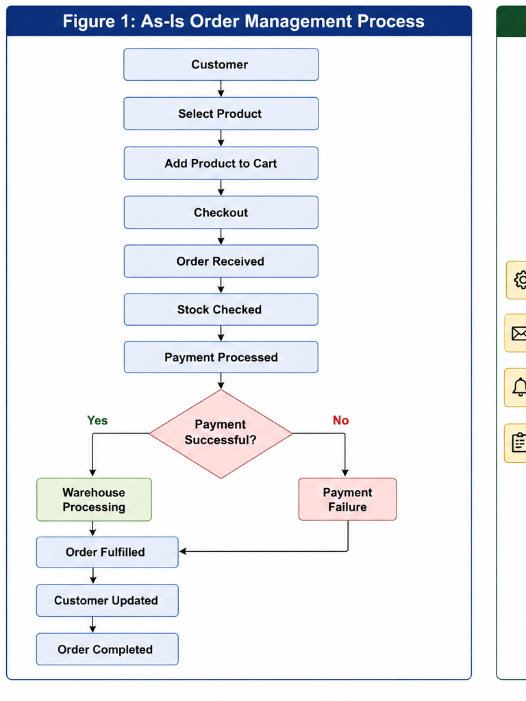
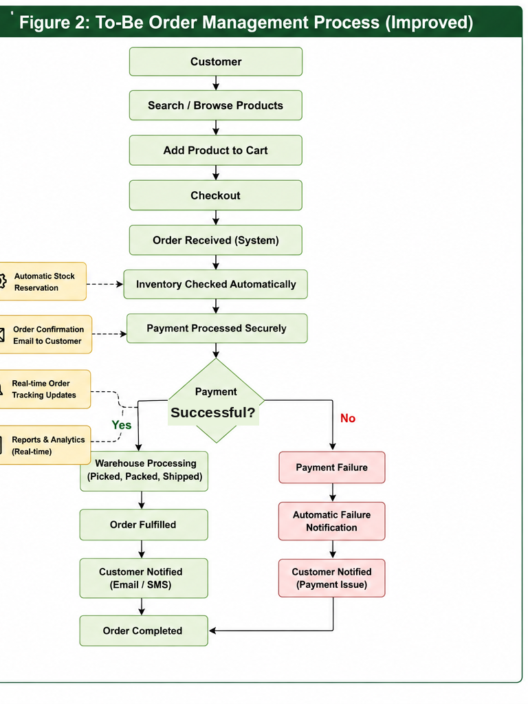

# Karoo Market — E-Commerce Order Management System

**Role:** Business Analyst (portfolio case study)
**Industry:** E-commerce / Retail
**Type:** Digital process & system improvement

📄 [Read the full report (PDF)](./Karoo_Market_BA_Project.pdf) · [Download the Word doc](./Karoo_Market_BA_Project.docx)

## The problem

Karoo Market's order lifecycle ran across disconnected systems, causing delayed processing, inaccurate inventory data, payment failures, and limited order visibility for customers.

| Metric | Baseline | Target |
|---|---|---|
| Order processing time | 14 minutes | < 5 minutes |
| Inventory accuracy | 82% | 98% |
| Payment failure rate | 8% | < 3% |
| Order-related complaints | 16% | < 7% |
| Manual processing | 65% | < 20% |

## What this case study covers

- Business case & stakeholder analysis
- Functional and non-functional requirements
- User stories with acceptance criteria
- Business rules
- As-is and to-be process mapping
- Use case documentation
- KPI definition
- Test case design
- Requirements traceability matrix (requirement → user story → test case)
- Risk analysis and final recommendation

## Process redesign

**As-Is:** Manual stock checks, disconnected payment confirmation, and no real-time order tracking.

**To-Be:** Automated stock reservation, secure payment processing, real-time tracking updates, and automated reporting.

## Outcome

The proposed system centralises order data and automates key manual steps, targeting faster processing, higher inventory accuracy, and fewer customer complaints — while giving the business real-time visibility it didn't have before.

---
[← Back to portfolio index](../README.md)
