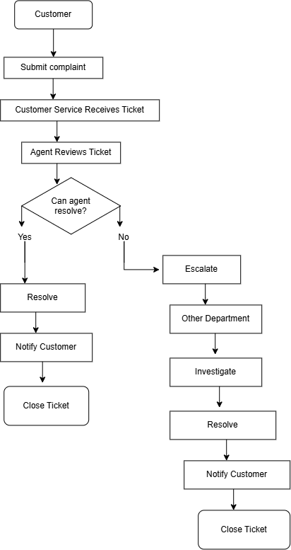
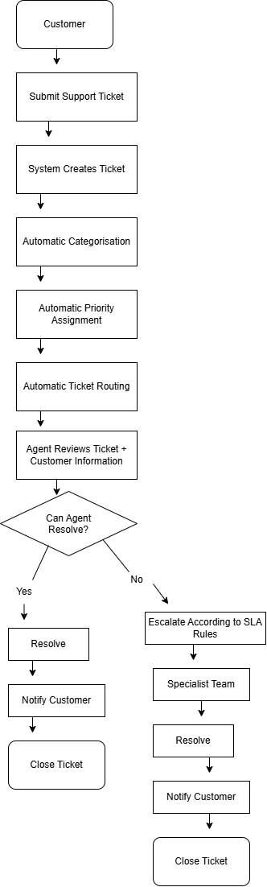

# Ubuntu Retail — Customer Service Process Improvement

**Role:** Business Analyst (portfolio case study)
**Industry:** Retail / E-commerce
**Type:** Digital process & system improvement

📄 [Read the full report (PDF)](./Ubuntu_Retail_BA_Project.pdf) · [Download the Word doc](./Ubuntu_Retail_BA_Project.docx)

## Project Overview

A Business Analysis case study focused on analysing and improving a customer service support process for Ubuntu Retail.

The project follows the Business Analysis lifecycle from identifying the business problem through requirements analysis, process modelling, solution design, and validation.

## Business Problem

The existing customer service process contains manual steps and inefficient ticket handling, which can lead to:

- Slow ticket resolution
- Incorrect ticket routing
- Delayed escalation
- Limited visibility of ticket performance
- Inconsistent customer communication
- 
## What this case study covers

- Business case & stakeholder analysis
- Functional and non-functional requirements
- User stories with acceptance criteria
- Business rules & SLA priority rules
- As-is and to-be process mapping
- KPIs & success measures
- Test case design (including a Gherkin-style detailed example)
- Requirements traceability matrix (requirement → user story → test case)
- Risk analysis and phased implementation recommendation

## Process redesign

**As-Is:** Manual ticket review, inconsistent escalation, and no SLA monitoring.

**To-Be:** Automatic categorization, priority assignment, ticket routing, and SLA monitoring with rule-based escalation.

## Outcome

The proposed solution automates ticket triage end-to-end and gives agents direct access to customer/order data at the point of resolution — targeting faster response times, fewer unnecessary escalations, and measurable SLA compliance.

---
[← Back to portfolio index](../README.md)
